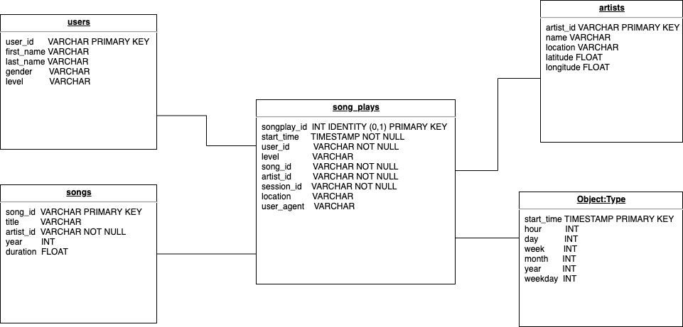
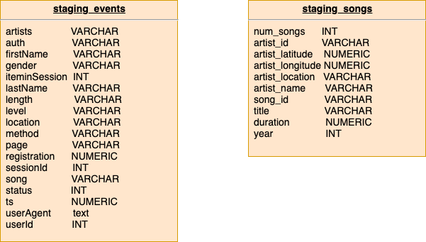

# Data Warehouse in AWS Redshift

A music streaming startup, Sparkify, has grown their user base and song database and want to move their processes and data onto the cloud. Their data resides in S3, in a directory of JSON logs on user activity on the app, as well as a directory with JSON metadata on the songs in their app. The task is building ETL pipeline. 

In that project below steps implemented:

1. Extracts their data from S3
2. Stages them in Redshift
3. Transform data into a set of dimensional tables

Below python libraries have been used.

* configparser
* psycopg2

## Database Schema

The star shema details shown below

The staging tables details shown below

## Project Datasets

Datasets reside in S3. 

Song data: `s3://udacity-dend/song_data`
Log data: `s3://udacity-dend/log_data`
Log data json path: `s3://udacity-dend/log_json_path.json`

#### 1. Song Dataset

Each file is in JSON format and contains metadata about a song and the artist of that song. The files are partitioned by the first three letters of each song's track ID. 

`song_data/A/B/C/TRABCEI128F424C983.json
song_data/A/A/B/TRAABJL12903CDCF1A.json`

JSON file looks like;

`{"num_songs": 1, "artist_id": "ARJIE2Y1187B994AB7", "artist_latitude": null, "artist_longitude": null, "artist_location": "", "artist_name": "Line Renaud", "song_id": "SOUPIRU12A6D4FA1E1", "title": "Der Kleine Dompfaff", "duration": 152.92036, "year": 0}`

#### 2. Log Dataset

Log files in JSON format generated by this event simulator based on the songs in the dataset 

`log_data/2018/11/2018-11-12-events.json
log_data/2018/11/2018-11-13-events.json
`

## Project Steps

* Fact and dimension schemas designed
* `Create` statement implmented for each of tables in `sql_queries.py` 
* `create_tables.py` files connect to Redshift database. Also, dropped all tables (2 staging tables, 1 fact table, and 4 dimension table) if exists and create new ones. 
* `dwh.cfg` file help to connect Redshift database with IAM role
* `create_tables.py` and `etl.py` files respectively executed and  data loaded from staging tables to analytics tables on Redshift

## Project Results

Below tables shows examples about results for song play analysis

* Artists

| artist_id          | name                 | location      | latitude | longitude |
|--------------------|----------------------|---------------|----------|-----------|
| ARWYVP51187B98C516 | The Suicide Machines | Detroit, MI   | 42.0     | -83.0     |
| ARP4QZ41187B99770C | BEFORE THE DAWN      |               |          |           |
| ARFO6G21187FB3E64C | Annet Artani         |               |          |           |
| AR9GUZF1187FB4D1BC | 10_000 Maniacs       | Jamestown, NY |          |           |
| ARGJFIQ11EBCD789D1 | U-N-I                | Inglewood, CA |          |           |

* song_plays

| songplay_id | start_time              | user_id | level | song_id            | artist_id | session_id | location | user_agent                                                                                                                                |
|-------------|-------------------------|---------|-------|--------------------|-----------|------------|----------|-------------------------------------------------------------------------------------------------------------------------------------------|
| 55          | 2018-11-04 09:34:58.796 | 44      | paid  | SOKLLZS12A8C13F208 |           | 196        |          | Mozilla/5.0 (Macintosh; Intel Mac OS X 10.9; rv:31.0) Gecko/20100101 Firefox/31.0                                                         |
| 119         | 2018-11-04 09:34:58.796 | 44      | paid  | SOJRCDU12AB0189D27 |           | 196        |          | Mozilla/5.0 (Macintosh; Intel Mac OS X 10.9; rv:31.0) Gecko/20100101 Firefox/31.0                                                         |
| 183         | 2018-11-04 09:34:58.796 | 44      | paid  | SOKLLZS12A8C13F208 |           | 196        |          | Mozilla/5.0 (Macintosh; Intel Mac OS X 10.9; rv:31.0) Gecko/20100101 Firefox/31.0                                                         |
| 247         | 2018-11-02 10:21:25.796 | 15      | paid  | SOVGBAH12AB018792A |           | 172        |          | "Mozilla/5.0 (X11; Linux x86_64) AppleWebKit/537.36 (KHTML, like Gecko) Ubuntu Chromium/36.0.1985.125 Chrome/36.0.1985.125 Safari/537.36" |
| 311         | 2018-11-05 02:09:47.796 | 44      | paid  | SOUNZHU12A8AE47481 |           | 237        |          | Mozilla/5.0 (Macintosh; Intel Mac OS X 10.9; rv:31.0) Gecko/20100101 Firefox/31.0                                                         |

* users

| user_id | first_name | last_name | gender | level |
|---------|------------|-----------|--------|-------|
| 53      | Celeste    | Williams  | F      | free  |
| 66      | Kevin      | Arellano  | M      | free  |
| 49      | Chloe      | Cuevas    | F      | free  |
| 63      | Ayla       | Johnson   | F      | free  |
| 29      | Jacqueline | Lynch     | F      | free  |

* time

| start_time              | hour | day | week | month | year | weekday |
|-------------------------|------|-----|------|-------|------|---------|
| 2018-11-04 09:23:21.796 | 9    | 4   | 44   | 11    | 2018 | 0       |
| 2018-11-05 11:08:56.796 | 11   | 5   | 45   | 11    | 2018 | 1       |
| 2018-11-09 18:32:52.796 | 18   | 9   | 45   | 11    | 2018 | 5       |
| 2018-11-05 02:45:11.796 | 2    | 5   | 45   | 11    | 2018 | 1       |
| 2018-11-19 04:39:59.796 | 4    | 19  | 47   | 11    | 2018 | 1       |

* songs

| song_id            | title             | artist_id          | year | duration |
|--------------------|-------------------|--------------------|------|----------|
| SOXTTGC12A6D4FB2DA | To The Races      | ARYO4YF1187FB4D827 | 2006 | 128.0    |
| SOCOZZE12A813568F7 | Willow Tree       | AROWOZ41187FB5B535 | 1997 | 206.0    |
| SOOGARI12AB0184863 | Speeka Box        | ARUYGUB11C8A415A47 | 2008 | 356.0    |
| SOUOVIB12AF729C93A | Alone             | ART9VTZ1187FB48DDC | 1972 | 329.0    |
| SOWNTQC12A67ADADA8 | Withering Heights | AR6472N1187FB4D003 | 2005 | 170.0    |

